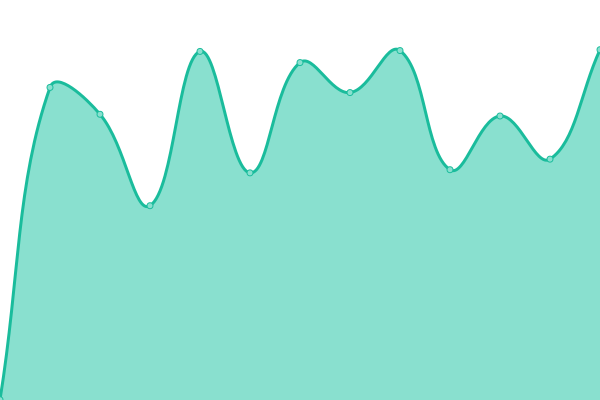

# [📈 Live Status](https://demo.upptime.js.org): <!--live status--> **🟩 All systems operational**

This repository contains the open-source uptime monitor and status page for [Tim Herbert](https://demo.upptime.js.org), powered by [Upptime](https://github.com/upptime/upptime).

With [Upptime](https://upptime.js.org), you can get your own unlimited and free uptime monitor and status page, powered entirely by a GitHub repository. We use [Issues](https://github.com/Tim-herbie/uptime/issues) as incident reports, [Actions](https://github.com/Tim-herbie/uptime/actions) as uptime monitors, and [Pages](https://demo.upptime.js.org) for the status page.

<!--start: status pages-->
<!-- This summary is generated by Upptime (https://github.com/upptime/upptime) -->
<!-- Do not edit this manually, your changes will be overwritten -->
<!-- prettier-ignore -->
| URL | Status | History | Response Time | Uptime |
| --- | ------ | ------- | ------------- | ------ |
|  [Blog](https://blog.cloud.timherbert.de) | 🟩 Up | [blog.yml](https://github.com/Tim-herbie/uptime/commits/HEAD/history/blog.yml) | 

 1499ms
     
 | 

<a href="https://demo.upptime.js.org/history/blog">100.00%</a>
    

|  [Opencloud](https://opencloud.timherbert.de) | 🟩 Up | [opencloud.yml](https://github.com/Tim-herbie/uptime/commits/HEAD/history/opencloud.yml) | 

 1045ms
     
 | 

<a href="https://demo.upptime.js.org/history/opencloud">100.00%</a>
    

|  [Keycloak](https://keycloak.timherbert.de) | 🟩 Up | [keycloak.yml](https://github.com/Tim-herbie/uptime/commits/HEAD/history/keycloak.yml) | 

 1091ms
     
 | 

<a href="https://demo.upptime.js.org/history/keycloak">100.00%</a>
    

|  [Saturn-Filmfreunde](https://saturn-filmfreunde.de) | 🟩 Up | [saturn-filmfreunde.yml](https://github.com/Tim-herbie/uptime/commits/HEAD/history/saturn-filmfreunde.yml) | 

 1682ms
     
 | 

<a href="https://demo.upptime.js.org/history/saturn-filmfreunde">100.00%</a>
    

|  [Bernd-Herbert](https://bernd-herbert.de) | 🟩 Up | [bernd-herbert.yml](https://github.com/Tim-herbie/uptime/commits/HEAD/history/bernd-herbert.yml) | 

 995ms
     
 | 

<a href="https://demo.upptime.js.org/history/bernd-herbert">100.00%</a>
    

<!--end: status pages-->

[**Visit our status website →**](https://demo.upptime.js.org)

## 📄 License

- Powered by: [Upptime](https://github.com/upptime/upptime)
- Code: [MIT](./LICENSE) © [Anand Chowdhary](https://anandchowdhary.com), supported by [Pabio](https://pabio.com)
- Data in the `./history` directory: [Open Database License](https://opendatacommons.org/licenses/odbl/1-0/)
